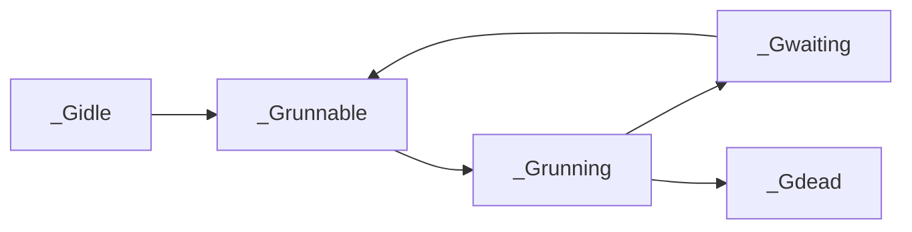

# 什么是GMP

## G（Goroutine）
G 是调度的基本单位，由 Go 运行时管理，比 OS 线程更轻量代表goroutine，主要保存状态信息以及C寄存器的值。           
当 goroutine 被调离 CPU 时，调度器负责把 CPU 寄存器的值保存在 g 对象的成员变量之中。
当 goroutine 被调度起来运行时，调度器又负责把 g 对象的成员变量所保存的寄存器值恢复到 CPU 的寄存器。

### Goroutine和线程的区别
* 内存开销
* 切换开销
* 运行环境

## M（Machine）

### 什么是M:N模型
M 个 goroutines (G) 被调度到 N 个内核线程 (M) 上执行，这些线程运行在最多 GOMAXPROCS 个逻辑处理器 (P) 上。      

P 负责管理 G 的本地运行队列（LRQ），每个 P 必须绑定一个 M 才能执行 G。如果某个 M 阻塞（如系统调用），与该 M 绑定的 P 会解绑，并由其他空闲的 M（或新建的 M）接管这个 P，继续执行其 LRQ 中的 G。

### M阻塞和G阻塞的区别
| 维度    | M 阻塞（线程级）| G 阻塞（协程级）  |
|-------|----------------|-----------------|
| 触发原因	 |系统调用、CGO 等底层操作	|Channel、锁、Gosched() 等用户态操作|
| 阻塞对象	 |内核线程（M）	|Goroutine（G）|
| 调度影响	 |P 与 M 解绑，可能创建新 M	|G 被移出运行队列，M 执行其他 G|
| 恢复机制	 |系统调用完成后重新绑定 P	|条件满足后重新加入运行队列|
| 性能代价	 |高（线程切换、内核态开销）	|低（用户态调度，无线程切换）|

## P（Processor）

### G、M、P的数量关系
P（逻辑处理器）的数量（X）：
由 GOMAXPROCS 环境变量或 runtime.GOMAXPROCS() 设置，默认值为当前 CPU 核数，固定不变（除非手动调整）。例如4 核机器默认 X = 4。

M（内核线程）的数量（Y）：
由运行时动态管理，初始时通常 Y = X（每个 P 绑定一个 M），当发生系统调用阻塞或需要更多线程时，Y 可能增长（如阻塞的 M 不释放，运行时创建新 M）。理论上 Y >= X，但一般不会无限增长（有上限限制，如 runtime/debug.SetMaxThreads）。

G（Goroutine）的数量（Z）：
用户代码动态创建，理论上 Z ≫ X 且 Z ≫ Y。 例如，一个服务器程序可能同时处理数万个 Goroutines，但 X 和 Y 可能仅为几十。

# 什么是Scheduler

Go scheduler 是 Go runtime 的一部分，它内嵌在 Go 程序里，和 Go 程序一起运行。因此它运行在用户空间，在 kernel 的上一层。

Runtime 起始时会启动一些 G：垃圾回收的 G，执行调度的 G，运行用户代码的 G；并且会创建一个 M 用来开始 G 的运行。随着时间的推移，更多的 G 会被创建出来，更多的 M 也会被创建出来。

Go scheduler 的核心思想是：
1. reuse threads；
2. 限制同时运行（不包含阻塞）的线程数为 N，N 等于 CPU 的核心数目；
3. 线程私有的 runqueues，并且可以从其他线程 stealing goroutine 来运行，线程阻塞后，可以将 runqueues 传递给其他线程。

为什么需要 P(Logic Processor) 这个组件，直接把 runqueues 放到 M 不行吗？
当一个线程阻塞的时候，将和它绑定的 P 上的 goroutines 转移到其他线程。          
Go scheduler 会启动一个后台线程 sysmon，用来检测长时间（超过 10 ms）运行的 goroutine，将其调度到 global runqueues。这是一个全局的 runqueue，优先级比较低，以示惩罚。

全局可运行队列（GRQ）和本地可运行队列（LRQ）。 LRQ 存储本地（也就是具体的 P）的可运行 goroutine，GRQ 存储全局的可运行 goroutine，这些 goroutine 还没有分配到具体的 P。

和线程类似，goroutine 的状态也是三种:
1. Waiting:等待状态，goroutine 在等待某件事的发生。例如等待网络数据、硬盘；调用操作系统 API；等待内存同步访问条件 ready，如 atomic, mutexes
2. Runnable:就绪状态，只要给 M 我就可以运行
3. Executing:运行状态。goroutine 在 M 上执行指令，这是我们想要的

## 调度Goroutine的时机

| 情形      | 说明                                                                 |
|---------|----------------------------------------------------------------------|
| 使用关键字go | go 创建一个新的 goroutine，Go scheduler 会考虑调度 |
| GC      | 由于进行 GC 的 goroutine 也需要在 M 上运行，因此肯定会发生调度。当然，Go scheduler 还会做很多其他的调度，例如调度不涉及堆访问的 goroutine 来运行。GC 不管栈上的内存，只会回收堆上的内存 |
| 系统调用    | 当 goroutine 进行系统调用时，会阻塞 M，所以它会被调度走，同时一个新的 goroutine 会被调度上来 |
| 内存同步访问  | atomic，mutex，channel 操作等会使 goroutine 阻塞，因此会被调度走。等条件满足后（例如其他 goroutine 解锁了）还会被调度上来继续运行 |

## 工作窃取
Go scheduler 的职责就是将所有处于 runnable 的 goroutines 均匀分布到在 P 上运行的 M 并执行它。

当一个 P 发现自己的 LRQ 已经没有 G 时，会从其他 P “偷” 一些 G 来运行。

当 P2 上的一个 G 执行结束，它就会去 LRQ 获取下一个 G 来执行。如果 LRQ 已经空了，就是说本地可运行队列已经没有 G 需要执行，并且这时 GRQ 也没有 G 了。这时，P2 会随机选择一个 P（称为 P1），P2 会从 P1 的 LRQ “偷”过来一半的 G。
这样做的好处是，有更多的 P 可以一起工作，加速执行完所有的 G。

## 协作式调度和抢占式调度
协作式调度一般会由用户设置调度点，例如 python 中的 yield 语法。           
但是由于在 Go 语言里，goroutine 调度的事情是由 Go runtime 来做，并非由用户控制，所以我们依然可以将 Go scheduler 看成是抢占式调度，因为用户无法预测调度器下一步的动作是什么。